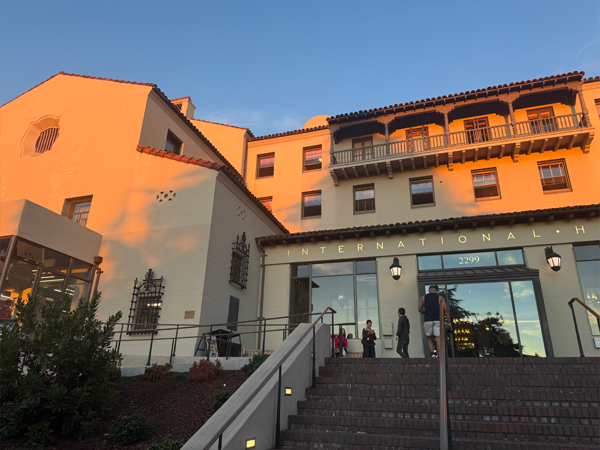
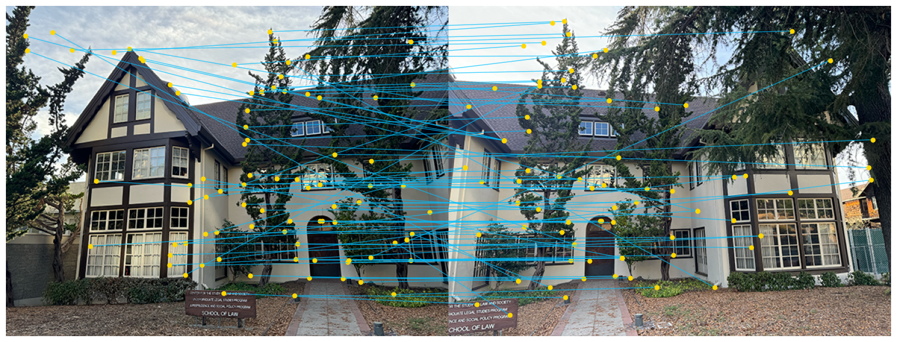

# Image Warping and Mosaicing  
### by Daniel Hodde

---

## Capturing the Images

Before continuing with image warping and mosaicing I first captured a set  
of images from around the UC Berkeley campus to use throughout the project.

### Doe Library  

### Hearst Mining  

### Wheeler Hall  

### IHouse Left  

### Law and Society Left  

### VLSB Left  

### IHouse Right  

### Law and Society Right  

### VLSB Right  

---

## Recovering Homographies

Before we are able to warp images, we first need to recover the parameters of the transformation between each image.

In our case, the transformation is a homography and is given by:

$$
\mathbf{p'} = H \mathbf{p}
$$

where $H$ is a $3 \times 3$ matrix with 8 degrees of freedom (since the bottom-right entry is set to 1 for normalization), and $\mathbf{p}$ and $\mathbf{p'}$ are the homogeneous coordinates of the points in the two images. This can be written as:

$$
\begin{bmatrix}
x' \\
y' \\
1
\end{bmatrix}
=
\begin{bmatrix}
h_1 & h_2 & h_3 \\
h_4 & h_5 & h_6 \\
h_7 & h_8 & 1
\end{bmatrix}
\begin{bmatrix}
x \\
y \\
1
\end{bmatrix}
$$

To recover the homography matrix $H$, we set up a system of linear equations using the point correspondences from the two images. The system takes the following form:

$$
\begin{bmatrix}
x_1 & y_1 & 1 & 0 & 0 & 0 & -x'_1 x_1 & -x'_1 y_1 \\
0 & 0 & 0 & x_1 & y_1 & 1 & -y'_1 x_1 & -y'_1 y_1 \\
x_2 & y_2 & 1 & 0 & 0 & 0 & -x'_2 x_2 & -x'_2 y_2 \\
0 & 0 & 0 & x_2 & y_2 & 1 & -y'_2 x_2 & -y'_2 y_2 \\
\vdots & \vdots & \vdots & \vdots & \vdots & \vdots & \vdots & \vdots \\
x_n & y_n & 1 & 0 & 0 & 0 & -x'_n x_n & -x'_n y_n \\
0 & 0 & 0 & x_n & y_n & 1 & -y'_n x_n & -y'_n y_n
\end{bmatrix}
\begin{bmatrix}
h_1 \\
h_2 \\
h_3 \\
h_4 \\
h_5 \\
h_6 \\
h_7 \\
h_8
\end{bmatrix}
=
\begin{bmatrix}
x'_1 \\
y'_1 \\
x'_2 \\
y'_2 \\
\vdots \\
x'_n \\
y'_n
\end{bmatrix}
$$

In this setup, the left-hand matrix grows by two additional rows for each new correspondence point pair, and the right-hand vector grows similarly with each new $(x'_i, y'_i)$ pair.

To avoid the system being underdetermined, we require at least 4 point correspondences between the two images. However, with only 4 correspondences, the solution may be sensitive to noise and instability. When there are more than 4 correspondences, resulting in an overdetermined system, we can solve for $H$ using least squares, providing a good approximate solution even in the presence of noise or small errors in the correspondences.

---

## Image Rectification

Using this homography we can now rectify images. To do this we manually select any known rectangular surface within an image and map it to an appropriately sized rectangle, yielding the following results:

### Doe Library
  
  

### Hearst Mining
  
  

### Wheeler Hall
  
  

---

## Image Blending

The image blending process uses a distance transform approach to smoothly combine two images. First, the source image is warped using a homography matrix and both images are placed on a larger canvas.

Distance transforms are computed from the alpha channels, with each pixel's value representing its distance to the nearest edge. These transforms are normalized and used as blending weights. Gaussian smoothing is applied to ensure soft transitions in overlapping areas.

The images are then blended using a weighted combination of the distance transforms. The alpha channel is handled by taking the maximum value from both images, ensuring correct transparency. This method ensures smooth, seamless blending based on pixel proximity to image edges.

### IHouse
  
  

### Law and Society
  
  

### VLSB
  
  

---

## Harris Interest Point Detector

The Harris corner detector identifies distinctive image points by analyzing local gradient patterns around small patches. The implementation computes a response matrix by examining sums of gradient products in local Gaussian windows. The response is large when there are strong gradients in multiple directions, indicating a corner.

To avoid unreliable detections near image boundaries, corners within 20 pixels of the border are discarded. While this creates a dense set of interest points that may be impractical for subsequent feature matching, it provides a solid foundation for further filtering steps.

---

## Adaptive Non-Maximal Suppression (ANMS)

As mentioned previously, Harris returns a dense set of corners that prove to be unreliable for matching features. To remedy this, we can run adaptive non-maximal suppression to select strong corners that are spaced throughout the image. We find 500 of these points determined by their suppression radius defined by:

$$
r_i = \min_j |\mathbf{x}_i - \mathbf{x}_j|, \; \text{s.t.} \; f(\mathbf{x}_i)
< c_{\text{robust}} f(\mathbf{x}_j), \; \mathbf{x}_j \in \mathcal{I}
$$

**IHouse Example:**  
  
  
  

**Law Example:**  
  
  
  

**VLSB Example:**  
  
  
  

---

## Feature Descriptor Extraction

After finalizing interest points, we extract features for each one, take a 40 × 40 window around each point, then downsample it by a factor of 5 to obtain an 8 × 8 patch. Next, we apply bias/gain normalization to ensure the patch has zero mean and unit variance. Finally, we flatten the patch into a vector, resulting in a feature descriptor for each interest point.

---

## Feature Matching

After extracting features we need to match across images to form correspondences. We identify matching descriptors between two images by calculating the Euclidean distance between each pair of feature descriptors. For each descriptor in the first image, it finds the two closest matches in the second image and computes the ratio between the smallest and second smallest distances.

If this ratio is below the specified threshold, the match is considered reliable, and the index pair is added to the list of matches. This approach filters out ambiguous matches, improving the accuracy of feature matching.

  
  

---

## RANSAC for Robust Matching

Even with the attempt to filter the matches, you can see that there are still some subpar matches. This is because the matches were computed with least squares, which is not very robust against outliers. To further filter the matches and ensure that the matches used to recover homographies are not affected by these outliers we can apply RANSAC and select only a subset of the best points.

**RANSAC Algorithm:**

1. Randomly select 4 feature matches  
2. Compute the exact homography $H$  
3. Identify inliers that satisfy $\text{dist}(p_i', H p_i) < \epsilon$  
4. Repeat steps 1–3 until reaching the max iterations  
5. Keep the largest set of inliers  
6. Recompute $H$ using least squares on this set

**RANSAC Results:**

  
  

---

## Results

Below are the results of manually stitching images vs automatically stitching them:

| Manual | Automatic |
|--------|-----------|
|  |  |
|  |  |
|  |  |

---